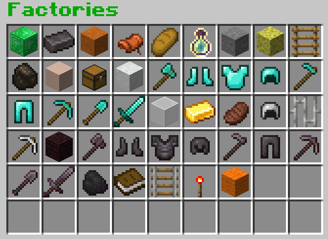
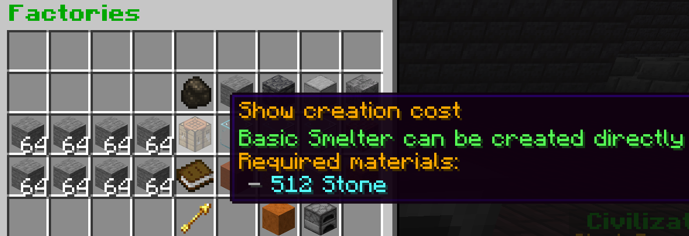
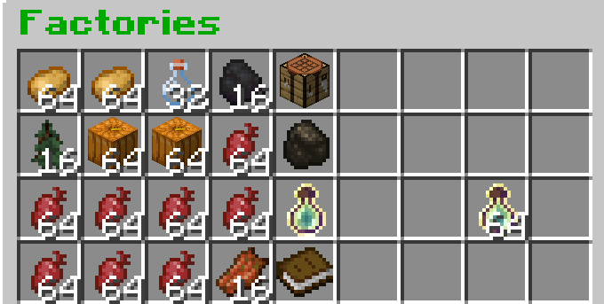

# Factorymod
Factories allow for efficient crafting of a lot of items. Often giving a better rate of return than normal. A good example is the ore smelter which will convert 16 diamond ore into 48 diamonds. All factories and their recipes can be viewed by performing the command **/fm.**

## Setting up a factory

A factory always consists of 3 things: A furnace, a crafting table, and at least 1 chest. This can be in any variation as long as the crafting table is what connects the chest to the furnace. 

After constructing one of these setups, hit the crafting table with a stick, this will bring up the factory GUI. Find a factory you'd like to make. For this example we'll take the **Basic smelter** factory. When clicking on the basic smelter shown in the menu as a stone block another menu will open. On the left here are the items required to make the factory, in this case 512 stone. On the right are all the recipes that this factory can run. clicking on them will display their inputs (left) and outputs (right).

So following the recipe to create the basic smelter factory, we put 512 stone (8 stacks) into the chest of the setup we built earlier. Hitting the crafting table with stick will create the factory.

## Using a factory
To make use of a factory and its recipes after it's been made you first punch the crafting table of the factory you'd like to use **with a stick**. This will bring up the recipes available. Select any of these by clicking on the item in the chest menu. The current active recipe will glow purple like an enchanted item (reopen the crafting table GUI after selecting a new recipe to see this effect change). 

After selecting a recipe close out of the menu and place the required materials into the chest. Then open the furnace and fill it with the required fuel. (Charcoal in most cases) To start the factory hit the furnace with a stick. The factory will now run its selected recipe until it runs out of materials or fuel. 

## Repairing a factory

**Factories can break**, either by a player who destroys part of the factory or by the passage of time. When this happens a factory will be in a **state of disrepair**, If then left for long enough the factory will break completely and will need to be recreated from scratch. The health of a factory and when it will break can be observed by punching the chest of the factory with a stick. 

To repair a factory one must run the repair recipe. Each factory has a different cost to repair and is usually similar to the cost of creating said factory. Some factories also have their own repair kits, such as the compactor factory. Which can be a convenient alternative to carrying the repair materials. 

## XP production

EXP, XP or Experience **cannot be gained through killing mobs**, smelting items or any other vanilla method. Experience is instead produced in the basic and advanced cauldron factories.

These factories produce either bottles o' enchanting, emeralds, or emerald blocks. Emeralds can be crafted into bottles o' enchanting, or held and used like food to grant the player 9 bottles worth of XP.
Bottles can be crafted back into emeralds for easy storage.

There are many different recipes that can be used depending on the crops you have (See Realistic Biomes) and can be seen using **/fm**. While the basic cauldron uses normal item stacks, the advanced version uses compacted items. Resulting in 2 stacks of emerald blocks rather than bottles. 

## Netherite production

Netherite, like XP, can only be produced using the appropriate factory, in this case the Advanced ore smelter factory. The recipe for Netherite is: 24 emeralds (xp), 8 gold ingots, 8 player essence and 12 ancient debris to produce 1 Netherite ingot. There are also specialized Netherite factories for armor and tools for cheaper production of these items. Find them in the /fm menu. 

## compacting

A compacted item is a stack (64) of an item converted into 1 item. Having 64 of a compacted item is known as a CS (Compacted Stack) A term often used in trading on the server. A CS refers to 64x64 (4096) items.

Items can be compacted in the compactor factory using crates (custom item, looks like a chest) which can in turn be made in the carpentry factory. 
